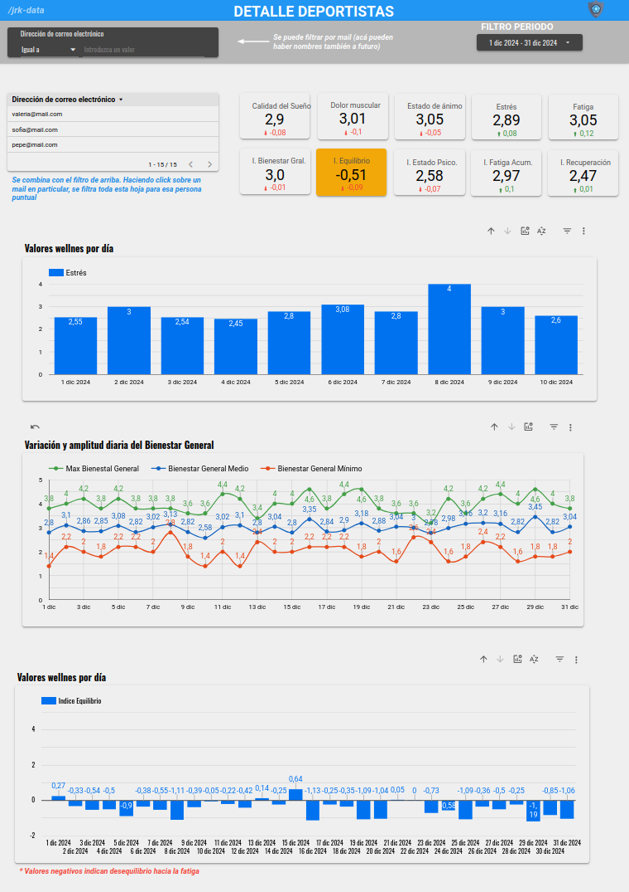
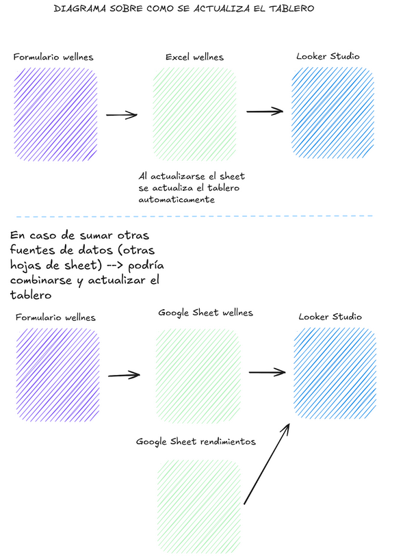

# Dash Wellness (proyecto minimalista)
## Resumen
Proyecto minimalista para el desarrollo de informes que visualicen el bienestar general de jugadores a partir de datos recolectados luego de sus entrenamientos.

## Indice
- [Dashboard Wellness Hockey](#dashboard-wellness-hockey)
- [Flujo de Desarrollo del Proyecto](#flujo-de-desarrollo-del-proyecto)
- [Formularios y Datos](#formularios-y-datos)
- [Índices Calculados](#índices-calculados)
  - [Índice de Bienestar General (IBG)](#índice-de-bienestar-general-ibg)
  - [Índice de Recuperación (IR)](#índice-de-recuperación-ir)
  - [Índice de Fatiga Acumulada (IFA)](#índice-de-fatiga-acumulada-ifa)
  - [Índice de Estado Psicológico (IEP)](#índice-de-estado-psicológico-iep)
  - [Variación Diaria del Bienestar (VDB)](#variación-diaria-del-bienestar-vdb)
  - [Índice de Equilibrio (IE)](#índice-de-equilibrio-ie)
  - [Índice de Riesgo de Sobrecarga (IRS)](#índice-de-riesgo-de-sobrecarga-irs)
  - [Índice de Cohesión del Grupo (Opcional)](#índice-de-cohesión-del-grupo-opcional)
- [Visualización de Resultados](#visualización-de-resultados)
- [Conclusión](#conclusión)

### Dashboard [link](https://lookerstudio.google.com/reporting/2f67848e-419a-4468-8397-0565a9e1dfbe/page/p_97gmttu9nd)

  

## Flujo de Desarrollo del Proyecto

Para este proyecto se optó por un desarrollo minimalista, priorizando la simplicidad sobre la escalabilidad. En lugar de construir una infraestructura compleja, se realizaron conexiones directas desde Looker Studio a las hojas de Google Sheets, permitiendo una implementación rápida y sencilla.
### Diagrama de Actualización del Tablero

---

## Formularios y Datos

- **Formulario de carga de datos** (link)
  - Datos cargados:
    - Calidad del sueño
    - Dolor muscular
    - Estado de ánimo
    - Estrés
    - Fatiga
- **Google Sheets** (link) para almacenamiento de datos.
- **Visualización en Looker Studio** (link):
  - Hoja principal con tabla de todas las jugadoras.
  - Estadísticas generales del equipo.
  - Filtros por jugadora para ver sus estadísticas personales:
    - Evolución diaria.
    - Valores medios en el período filtrado.
    - Valores mínimos y máximos.

---

## Índices Calculados

### 1. Índice de Bienestar General (IBG)
**Mide:** Nivel general de bienestar de la deportista.

**Cálculo:**
\[ IBG = \frac{Sueño + Dolor Muscular + Fatiga + Ánimo + Estrés}{5} \]

Las ponderaciones pueden ajustarse según la relevancia de cada métrica.

### 2. Índice de Recuperación (IR)
**Mide:** Nivel de recuperación física y mental.

**Cálculo:**
\[ IR = \frac{Sueño + (5 - Dolor Muscular)}{2} \]

Valores más altos indican mejor recuperación.

### 3. Índice de Fatiga Acumulada (IFA)
**Mide:** Nivel de agotamiento debido a carga física o estrés.

**Cálculo:**
\[ IFA = \frac{Fatiga + Estrés}{2} \]

Ayuda a determinar si es necesario reducir la intensidad del entrenamiento.

### 4. Índice de Estado Psicológico (IEP)
**Mide:** Bienestar emocional y mental.

**Cálculo:**
\[ IEP = \frac{Ánimo + (5 - Estrés)}{2} \]

Valores bajos pueden indicar problemas emocionales que impacten el rendimiento.

### 5. Variación Diaria del Bienestar (VDB)
**Mide:** Cambios en las puntuaciones individuales o combinadas entre días consecutivos.

**Cálculo:**
\[ VDB = IBG_{hoy} - IBG_{ayer} \]

Permite identificar tendencias preocupantes o mejoras en el bienestar.

### 6. Índice de Equilibrio (IE)
**Mide:** Balance entre fatiga y recuperación.

**Cálculo:**
\[ IE = IR - IFA \]

Valores negativos indican desequilibrio hacia la fatiga.

### 7. Índice de Riesgo de Sobrecarga (IRS)
**Mide:** Potencial riesgo de sobreentrenamiento.

**Cálculo:**
\[ IRS = Factor_{ajustado} \times IFA \]

**Interpretación:**
- IRS < 1: Buen equilibrio entre carga y recuperación.
- 1 ≤ IRS ≤ 2: Nivel de riesgo moderado, se recomienda monitorear la recuperación.
- IRS > 2: Alto riesgo de sobrecarga, se recomienda reducir la intensidad o aumentar la recuperación.

### 8. Índice de Cohesión del Grupo (Opcional)
**Mide:** Bienestar promedio del equipo.

**Cálculo:**
\[ ICG = Promedio(IBG_{todas\ las\ deportistas}) \]

Ayuda a planificar actividades grupales y detectar problemas colectivos.

---

## Visualización de Resultados

- Se utilizan gráficos de tendencia para observar los índices a lo largo del tiempo.
- Identificación de patrones que sugieran necesidad de intervención.
- Implementación de alertas basadas en umbrales críticos.

---

## Conclusión

Se eligió un flujo de trabajo minimalista para este proyecto con el objetivo de brindar una solución rápida, accesible y fácil de manejar para los stakeholders. La conexión directa entre Google Sheets y Looker Studio permite un acceso inmediato a los datos sin necesidad de una infraestructura compleja, facilitando su uso y permitiendo que los stakeholders interactúen y analicen la información de manera sencilla.

### Ventajas
- **Simplicidad y rapidez:** La configuración e implementación del flujo fue ágil y sin grandes requerimientos técnicos.
- **Accesibilidad:** Los stakeholders pueden interactuar y modificar los datos directamente en Google Sheets sin necesidad de conocimientos en SQL o herramientas avanzadas de BI.
- **Costo reducido:** No se requieren servidores ni almacenamiento en BigQuery, lo que evita costos adicionales.
- **Iteración flexible:** Se pueden hacer cambios en la estructura de datos sin necesidad de un desarrollo adicional.

### Desventajas
- **Falta de escalabilidad:** Este flujo no está preparado para manejar grandes volúmenes de datos ni múltiples fuentes simultáneamente.
- **Limitaciones en la gestión de datos:** No hay control sobre la calidad de los datos ingresados, lo que puede generar inconsistencias.
- **Dependencia de Google Sheets:** Las hojas de cálculo pueden volverse lentas o ineficientes a medida que crece la cantidad de registros.
- **Seguridad y control:** No se dispone de mecanismos avanzados de seguridad ni auditoría sobre las modificaciones en los datos.

Para escenarios más complejos, donde se manejan múltiples fuentes y grandes volúmenes de datos, es recomendable implementar una solución más robusta basada en BigQuery, Dataform y una infraestructura de procesamiento más estructurada.

---